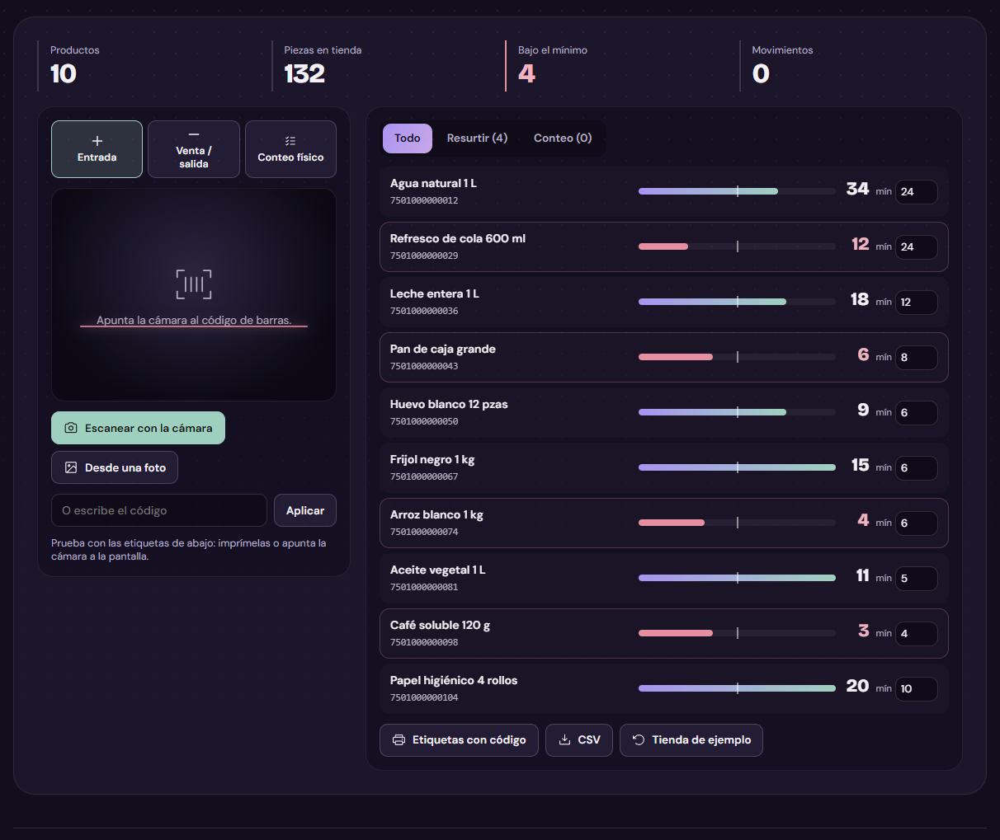

# Inventario con la cámara

[](https://github.com/Brunich/Inventario-QR-Con-Camara/actions/workflows/ci.yml)

*La cámara del celular como lector de códigos.*

Escaneas el código de barras con el celular y suma una entrada, resta una venta o cuenta el anaquel. Avisa lo que está bajo el mínimo y arma la lista para el proveedor.



**Pruébalo en vivo:** [bruno-portfolio-azure.vercel.app/proyectos/inventario](https://bruno-portfolio-azure.vercel.app/proyectos/inventario)

**App Android nativa:** en desarrollo. Escaneará códigos con la cámara del teléfono (CameraX) y guardará el inventario sin conexión.

## Cómo funciona

1. **Escanea.** Con la cámara, con una foto del código o escribiéndolo. Si el código no existe, lo das de alta ahí mismo.
2. **Cuenta.** En modo conteo escaneas cada pieza; al cerrar, el sistema toma lo contado y registra la diferencia.
3. **Resurte.** Lo que está bajo el mínimo sale en una lista para mandar por WhatsApp. Y si tus productos no traen código, imprime etiquetas EAN-13.

## Qué hay adentro

| Archivo | Qué hace |
| --- | --- |
| `src/inventario-logic.ts` | EAN-13: dígito verificador, validación, barras y etiqueta en SVG; y la lista de lo que está bajo el mínimo. |
| `src/Inventario.tsx` | Cámara (ZXing) con EAN-13, EAN-8, UPC-A y códigos internos; modos entrada / venta / conteo, búsqueda, historial por producto, etiquetas para imprimir y pedido por WhatsApp. |

La lógica está separada de la interfaz, así se prueba sin navegador (`tests/`).

## Decisiones

- La cámara del celular hace de lector: no hay que comprar escáner.
- Al leer un código vibra en vez de sonar; si el mismo código se repite en un instante no se cuenta dos veces.
- Si un producto no trae código, se genera un EAN-13 válido y se imprime la etiqueta.
- Se guarda en el navegador: sirve en una tienda pequeña sin servidor.

## Correrlo

```bash
npm install
npm run dev
```

```bash
npm test        # pruebas de la lógica (node:test)
npm run build   # tipos + build de producción
```

Hecho con React 19, TypeScript y Vite. Necesita Node 22 o más nuevo (las pruebas corren TypeScript directo con Node).

## Licencia

[MIT](LICENSE). Úsalo, cámbialo y compártelo; sólo conserva el aviso de copyright.

---

Parte del [portafolio de Bruno Salas](https://bruno-portfolio-azure.vercel.app) · [GitHub](https://github.com/Brunich)
